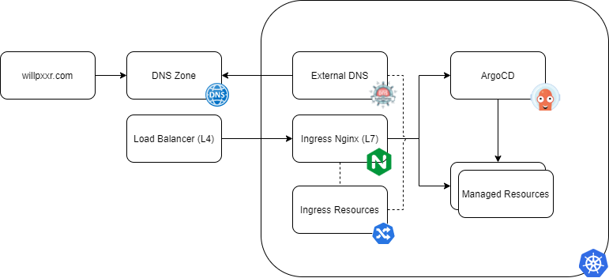

# Infrastructure Live

## Overview

### Terraform

Provides infrastructure as code for provisioning required cloud components (dns zone, kubernetes instance etc.)

### Bootstrap

Provides ArgoCD app-of-apps pattern, for "bootstrapping" the kubernetes cluster with any required applications.
